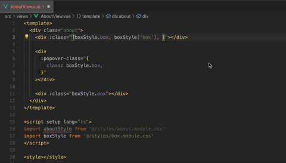

# vue-outer-module-style-class-helper

> 这是vscode 的插件项目，用于.vue文件的引入外部的css module样式文件的helper

## 功能
- 支持vue单文件中引入的外部css module 的文件，在输入时提示，以及点击进入定义的地方

## TODO
- [x] 支持vue单文件中的输入:class="style."  时的提示
- [x] 支持vue单文件中点击:class="style.box" 时进入具体的样式定义处
- [x] 缓存优化，以及缓存清理
- [x] 支持属性传递的情况下的跳转，类似：
基础信息

- [x] 支持数组的情况下的跳转，类似：
基础信息

- [x] 排除样式文件中符合条件的:global 下的class /^\.([a-zA-Z0-9_-]+)(?=\s*[{])/gm 
- [ ] 输入:class="style." 提示选择["header-wrapper"]的形式不能替换代.
- [ ] 支持vue标签引入的解析

## 打包与使用
- 1、项目中安装 @vscode/vsce  `pnpm add -D @vscode/vsce`
- 2、打包`npx vsce package`
- 3、把生成的`.vsix`文件按照的自己的vscode中即可使用